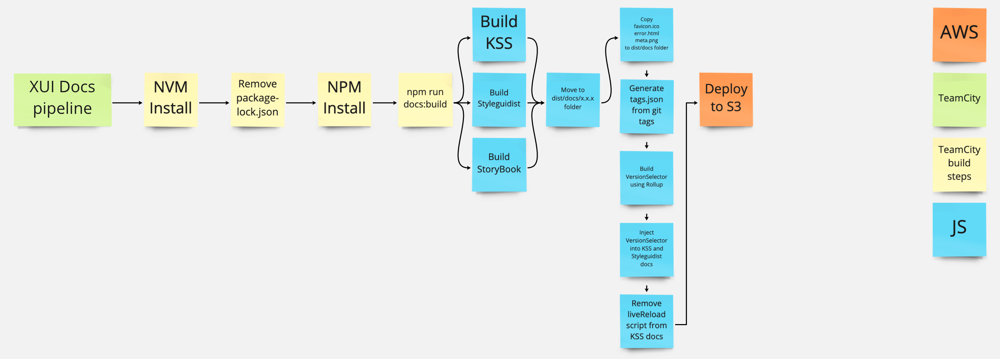

# XUI Docs Kotline Pipeline

[View this pipeline in TeamCity](https://teamcity1.inside.xero-support.com/project/Xui_XuiDocs?mode=builds)

This pipeline was set up using [PaaS' TeamCity Kotlin instructions](https://paas.xero.dev/docs/teamcity/kotlin/kotlin-build-from-scratch)

## Using the pipeline

### XUI releases

Our plan is to set this pipeline up to run automatically during a XUI release. We'll set this up when we migrate the main XUI release pipeline to Kotlin as it will be easier to integrate once it's in TeamCity.

### Manual releases

You can trigger this pipeline manually to release changes to XUI's documentation site without running a XUI release. To do so, follow the steps below:

- Merge changes to be deployed to the `main` branch
  - Check that the version in `package.json` matches the version of the documentation you want to overwrite
- [Run the pipeline in TeamCity](https://teamcity1.inside.xero-support.com/project/Xui_XuiDocs?mode=builds)
  - Running "Build XUI docs" will automatically trigger the other pipeline steps
- Merge `main` into `patch` once you have finished the release

## Pipeline overview

This pipeline is responsible for building and deploying XUI's documentation site to S3. When ran, it will do the following:

- Run `npm run docs:build`
  - This builds the XUI Guide, React docs, StoryBook, and the version selector in `dist/docs`
  - The XUI Guide, React docs, and StoryBook will be placed in a sub folder reflecting the version in `package.json`
- Deploy `dist/docs` to S3 using the TC S3 helper (this automatically records the deployment in Artifactory)

