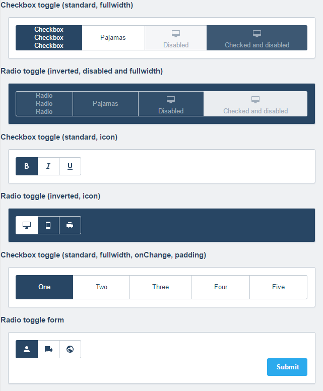

# xui-toggle


React components to render xui styled toggles `(xui 10.6.0 and above)` using `radio` or `checkbox` inputs. Toggles may contain any combination of text, images or [SVG icons](https://github.dev.xero.com/UXE/xui-icon).

###### `XUIToggleOption`
* Renders a single toggle option
* **Requires** an `onChange` function to manage the state of the input

###### `XUIToggle`
* Renders a container for a group of toggle options
* Provides `standard` and `inverted` colors
* Provides `fullwidth` and `icon` layouts

### Installation

```sh
bower install --save git@github.dev.xero.com:UXE/xui-toggle.git
```

### NPM Scripts

Run unit tests:
```sh
npm run test
```

Run unit tests with coverage report:
```sh
npm run test-coverage
```

Build standard UI test in the `test/ui` folder
```sh
npm run test-ui
```

### Example

The [`Object.assign()`](https://developer.mozilla.org/en-US/docs/Web/JavaScript/Reference/Global_Objects/Object/assign)
method can be used with the spread operator to shallow merge shared and individual properties for `XUIToggleOption` components.

```jsx
import React from 'react';
import ReactDOM from 'react-dom';
import XUIToggle, {XUIToggleOption} from 'xui-toggle';

const shared = {
	name: 'toggle-checkbox',
	onChange: () => {alert('Hello, World!')},
	type: 'checkbox'
};

(function() {
	ReactDOM.render(
		<div>
			<div className="xui-text-panelheading xui-margin-bottom">Checkbox toggle (inverted, fullwidth)</div>
			<div className="xui-panel xui-margin xui-padding xui-text-inverted">
				<XUIToggle color="inverted" layout="fullwidth">
					<XUIToggleOption {...Object.assign({}, shared, {isChecked: true})}>
						Checkbox<br/>Checkbox<br/>Checkbox<br/>
					</XUIToggleOption>
					<XUIToggleOption {...shared}>
						Pajamas
					</XUIToggleOption>
					<XUIToggleOption {...Object.assign({}, shared, {isDisabled: true})}>
						<svg className="xui-icon">
							<use xlinkHref="#xui-icon-desktop" role="presentation"></use>
						</svg>
						Disabled
					</XUIToggleOption>
					<XUIToggleOption {...Object.assign({}, shared, {isChecked: true, isDisabled: true})}>
						<svg className="xui-icon">
							<use xlinkHref="#xui-icon-desktop" role="presentation"></use>
						</svg>
						Checked and disabled
					</XUIToggleOption>
				</XUIToggle>
			</div>
		</div>,
		document.getElementById('app')
	);
})();
```

### XUIToggleOption Properties

|  Property  |                      Description                     |   Type   |  Default  |
|------------|------------------------------------------------------|----------|-----------|
| className  | Additional classes to apply to the root node         | string   | undefined |
| qaHook     | The automation ID to apply to the root node          | string   | undefined |
| isChecked  | The input is selected                                | bool     | undefined |
| isDisabled | The input is disabled                                | bool     | undefined |
| isRequired | The input is required for form submission            | bool     | undefined |
| name       | The name to use as a reference for the value         | string   | undefined |
| onChange   | The function to call when the control changes state  | function | undefined |
| type       | The type of the input                                | string   | 'radio'   |
| value      | The value to return on form submission               | string   | undefined |

###### `type` values

|    Value   |    Description     |
|------------|--------------------|
| 'radio'    | A `radio` input    |
| 'checkbox' | A `checkbox` input |

### XUIToggle Properties

Note that the `xui-text-inverted` class must be used on the parent of a `XUIToggle` component when the `color` property is set to `'inverted'`.

|  Property  |                      Description                     |   Type   |  Default   |
|------------|------------------------------------------------------|----------|------------|
| className  | Additional classes to apply to the root node         | string   | undefined  |
| qaHook     | The automation ID to apply to the root node          | string   | undefined  |
| color      | The color of the toggle                              | string   | 'standard' |
| layout     | The layout of the toggle                             | string   | undefined  |

###### `color` values

|   Value    |                             Description                             |
|------------|---------------------------------------------------------------------|
| 'standard' | Dark text on light background                                       |
| 'inverted' | Light text on dark background (parent must use `xui-text-inverted`) |

###### `layout` values

|    Value    |            Description           |
|-------------|----------------------------------|
| 'fullwidth' | Suitable for mixed label content |
| 'icon'      | Suitable for icon toolbars only  |

### Pretty Pictures


