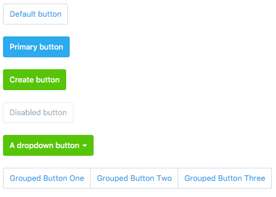

xui-button
==========
[/statusIcon)](https://teamcity.dev.xero.com/viewType.html?buildTypeId=XeroJS_SharedReactComponents_UxeXuiButton)


A React UI component that creates buttons from the [XUI UI library](https://github.dev.xero.com/pages/Style/xui/section-buttons.html). This includes single buttons and grouped buttons



## Installation

```bash
$ bower install --save git@github.dev.xero.com:FutureRobot/xui-button.git
```

### XUI Button Properties
`isDisabled`: (Boolean, Optional) Determines if the button is disabled or not. Set to false by default

`isGrouped`: (Boolean, Optional) Automatically set to true when it's a child of XUIButtonGroup. Set to false by default otherwise

`onClick`: (Function, Required) Bind a function to fire when the button is clicked

`variant`: (String, Optional) Determines what the purpose of this button is. `primary`, `create` or `negative`. If nothing is provided then it is a default button

`size`: (String, Optional) Modifier for the size of the button. `small`, or `full-width`. Else ignored

`type`: (String, Optional) The HTML type of this button. `button`, or `link`. Defaults to `button`

`buttonType` (String, Optional} The type attribute of this button. `submit`, `button`, or `reset`. Defaults to `submit`

`className`: (String, Optional) Any extra modifier classes you want on the button

`href`: (String, Optional) If this button is type `link` then this will be the hyperlink reference. Else ignored

`target`: (String, Optional) The `target` attribute for the button if the type is `link`. Else ignored

`title`: (String, Optional) The `title` attribute for this button

`tabIndex`: (Boolean, Optional) The HTML `tabIndex` attribute which will go on the node.  Default `0`

### XUI Button Caret Properties
`isSelect`: (Boolean, Optional) Determines if the caret has select styles. Defaults to false.

### Example
```js
import XUIButton, {XUIButtonGroup, XUIButtonCaret} from 'xui-button';

<XUIButton
	isDisabled={true}
	onChange={this.handleClick}
	variant='create'
	size='full-width'>Click me</XUIButton>

<XUIButton>I am a dropdown <XUIButtonCaret /></XUIButton>

<XUIButtonGroup>
	<XUIButton>Grouped one</XUIButton>
	<XUIButton>Grouped two</XUIButton>
</XUIButtonGroup>

```
